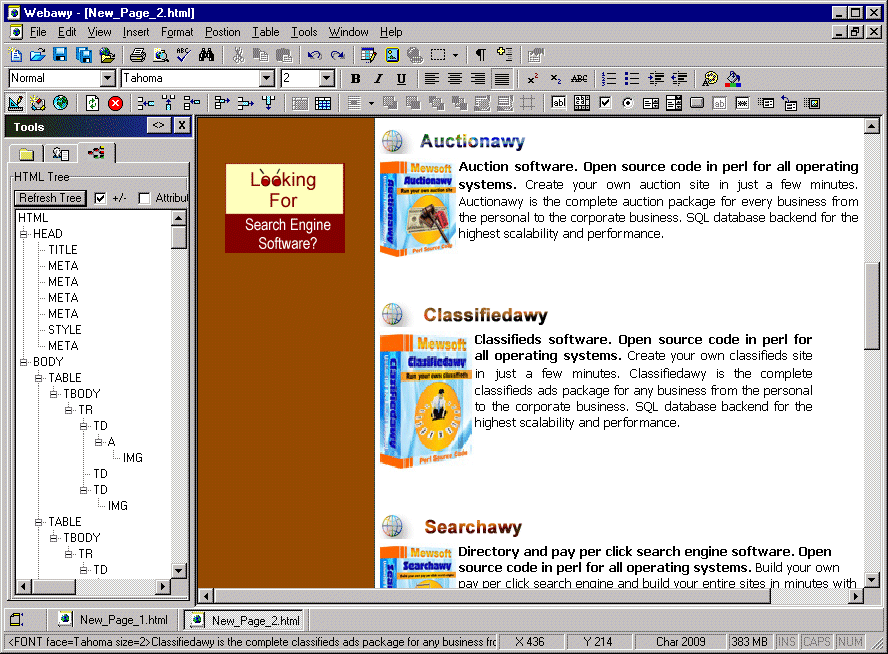



## WYSIWYG Full HTML Editor MDI \(Updated 04/23/06\)

### Description

Full Visual HTML editor WYSIWYG using microsoft DHTMLEdit control, MDI with many features for direct access the DOM and support more functions and lots of helpful tips and code for building full visual editor. Please also check my other project for MSHTML activex control wrapper here.
 
### More Info
 

             |
---                |---
**Submitted On**   |2006-04-20 19:31:50
**By**             |[Ahmed Amin Elsheshtawy](https://github.com/Planet-Source-Code/PSCIndex/blob/master/ByAuthor/ahmed-amin-elsheshtawy.md)
**Level**          |Intermediate
**User Rating**    |4.8 (57 globes from 12 users)
**Compatibility**  |VB 3\.0, VB 4\.0 \(16\-bit\), VB 4\.0 \(32\-bit\), VB 5\.0, VB 6\.0, VB Script, ASP \(Active Server Pages\) , VBA MS Access, VBA MS Excel
**Category**       |[Complete Applications](https://github.com/Planet-Source-Code/PSCIndex/blob/master/ByCategory/complete-applications__1-27.md)
**World**          |[Visual Basic](https://github.com/Planet-Source-Code/PSCIndex/blob/master/ByWorld/visual-basic.md)
**Archive File**   |[WYSIWYG\_Fu199099512006\.zip](https://github.com/Planet-Source-Code/ahmed-amin-elsheshtawy-wysiwyg-full-html-editor-mdi-updated-04-23-06__1-65056/archive/master.zip)

